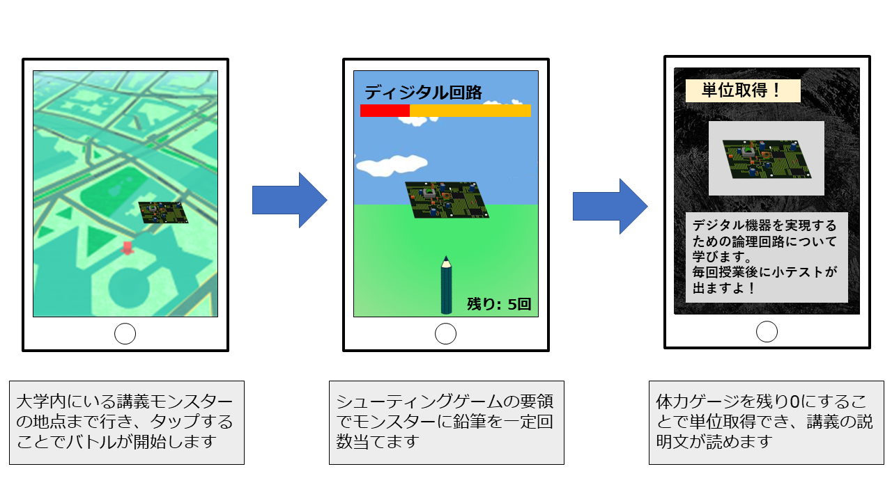

# Game_app

## アプリケーション概要
- 学祭用の学内探検型単位取得シューティングゲームです

## 世界観
- 名工大の講義がモンスターと化してしまい，講義が開講される棟付近に居座っている
- 鉛筆をモンスターに一定回数ぶつけることでモンスターを倒し，単位を取得しよう
  - 鉛筆は出席とみなしている
    - 鉛筆の残機: 講義の開講回数
    - あてた回数: 出席回数
    - 外れた回数: 欠席回数
    - 残りの体力: 単位取得に必要な残りの出席回数
  - 一定回数鉛筆をぶつけることができなかった場合は落単となり，敗北
    - 出席回数が単位取得条件を満たさなかったとしている

## 利用方法
- 学内マップ上に存在する講義モンスターの場所まで辿り着き，タップによってシューティングゲームが開始されます
  - クリアすることでその講義の単位が取得完了となります

## アプリケーションの目的
- 使用してくれるユーザが楽しむことができるアプリケーション
  - [前年度の作品](https://gitlab.com/taked1664/stamprally_app)から，多くプレイしていただいていたユーザ層を分析し，より楽しめられるように設計
    - お子様: 親御さんのスマホを借りてプレイしていた子が多かった
      - ゲームのほうが楽しむことができる
      - 操作は単純な物が良い
    - 高校生: 大学や研究室見学のために来て，その前後で遊んでもらえるという方が多かった
      - 研究内容や大学の雰囲気だけでなく，実際に学べる内容についても知っていってもらいたい
- 学内の探検
  - [前年度の作品](https://gitlab.com/taked1664/stamprally_app)の反省点として，その棟ではどのようなことを行っているかが分からないという問題点があった．
    - スタンプラリーのチェックポイントとなっているだけ
  - 棟の特色などを反映させた学内案内をしたい
    - 主に生命・応用化学科が使用する
    - 薬品を保管するための大きなタンクがある など
- 講義の紹介
  - 前年度は講義の紹介が必要だと感じられる場面が多々あった
    - 地域の方に，あなた方はどんな研究をしているんですか？と尋ねられる
    - 名工大の受験を視野に入れているであろう高校生が多数訪れている など
  - 名工大ではどのようなことを学んでいるのかということを，各学科ごとに紹介するとより楽しんでいってもらえるのではないかと考えた

## アプリケーションの流れ
1. サーバから取得された利用規約に同意
2. ユーザ名(他ユーザとの重複不可)を入力しユーザ登録
3. ゲーム開始
4. サーバから得た情報をもとに配置されたモンスター付近まで，マップを頼りに移動する
5. バトル圏内でモンスターをタップすることでバトル開始
6. 規定回数鉛筆をぶつけることで単位取得
7. 図鑑画面から講義の説明文が読めるようになる
8. 4.以降を繰り返す

## イメージ図
- 実際のプレイ画面が用意できなかったため，記憶を頼りにイメージ図を作成しました

